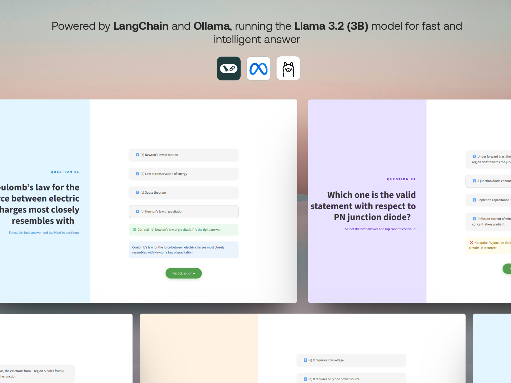
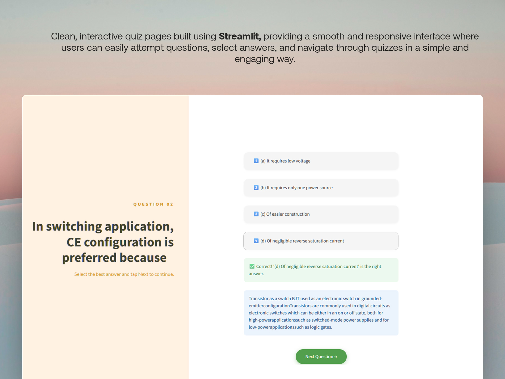

# paper2quiz

> Turn any PDF into a quiz — automatically.

**paper2quiz** uses a LangChain AI agent to extract multiple-choice questions directly from your PDF files. Upload a paper, get a quiz. No manual work needed.


## What it does

paper2quiz reads through your PDF, finds questions and their answers, and outputs clean structured JSON ready to use in any quiz app. If an answer isn't explicitly written in the document, the agent searches the web to find it automatically.





---

## Getting Started

### Install dependencies

```bash
pip install langchain langchain-community langchain-ollama langchain-google-genai langchain-text-splitters pypdf duckduckgo-search pydantic streamlit
```

### Install and run Ollama

Download [Ollama](https://ollama.com), then pull the required model:

```bash
ollama pull llama3.2:3b
ollama serve
```

### Run the UI

```bash
streamlit run ui.py
```

### Run without UI

```python
from llm import get_chunks, use_llm

chunks = get_chunks("your_file.pdf")
result = use_llm(chunks)
print(result)
```

---

## Known Issues & Limitations

**File path is currently hardcoded**
The PDF path is set to `4.pdf` inside `get_chunks()`. A file upload interface or CLI argument is not yet implemented — you need to change the path manually in the code for now.

**Model may return invalid JSON**
The LLM occasionally produces malformed JSON. The code catches parse errors and returns a `no_answer` fallback object, but the question is lost in that case. Retry logic or output validation is not yet in place.

**May occationally return wrong aswers**
There are instances where it might provide wrong answer from internet

**User interaction is slow and buggy**
The experience can feel unresponsive, especially when the agent is waiting on the web search tool.

**Questions can be slow to load**
Depending on your machine and model size, each question extraction can take several seconds. There is no progress indicator or streaming output yet.

**User interaction is slow and buggy**
The experience can feel unresponsive, especially when the agent is waiting on the web search tool.